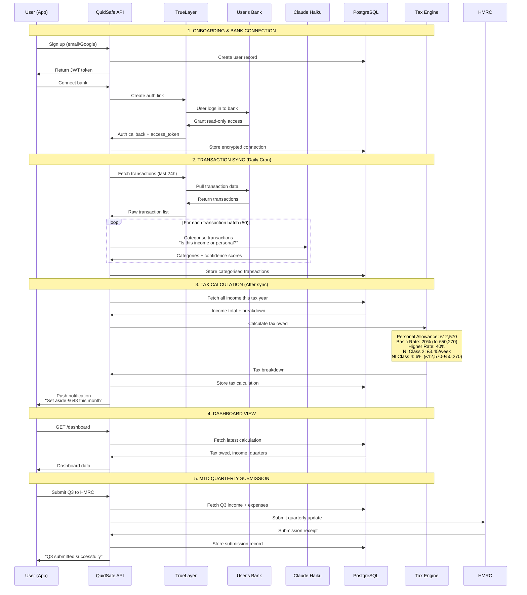
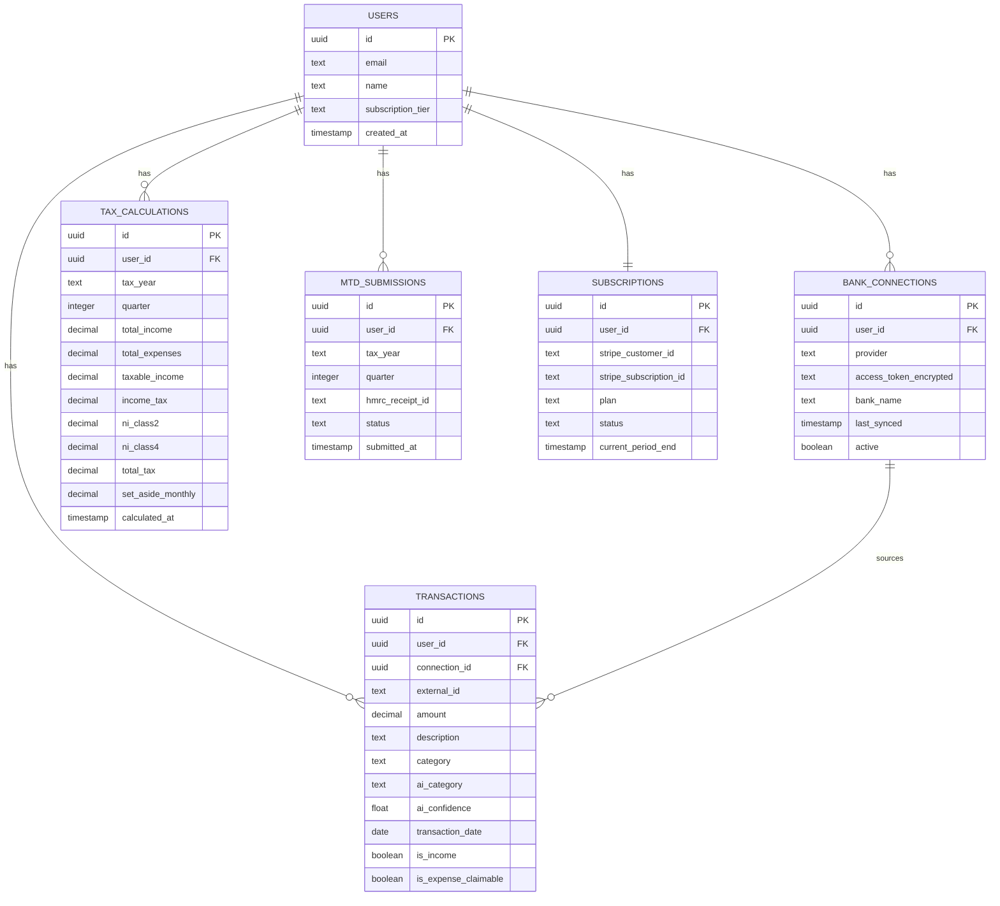
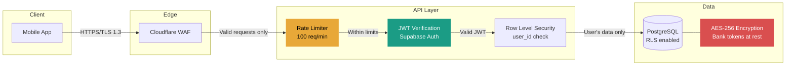

# Data Flow Architecture

## Core Data Flow

## Database Schema (Key Tables)

## Security Architecture

## Key Security Measures

1. **Bank tokens encrypted at rest** — AES-256 via Supabase Vault
2. **Row Level Security** — Users can only access their own data
3. **Rate limiting** — 100 req/min per user via Upstash Redis
4. **JWT expiry** — 1 hour access token, 7 day refresh token
5. **No card data stored** — Stripe handles all payment info
6. **Open Banking is read-only** — Cannot initiate payments
7. **HTTPS everywhere** — TLS 1.3 via Cloudflare
8. **Secrets management** — Environment variables via Fly.io secrets
