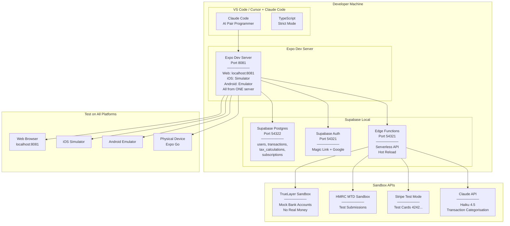

# Development Environment Architecture

## Overview

Minimal local setup — Expo handles web + mobile from one dev server. Supabase CLI provides local database + auth + edge functions. No Docker needed for basic development.



## Local Setup (No Docker Required)

```bash
# Install Supabase CLI
npm install -g supabase

# Initialise local Supabase (starts Postgres + Auth + Edge Functions)
supabase init
supabase start
# → Outputs: API URL, DB URL, anon key, service key
```

This single command gives you everything: Postgres, Auth, Edge Functions, Storage, and a local dashboard at `localhost:54323`.

## Environment Variables (.env.local)

```bash
# Supabase (from `supabase start` output)
EXPO_PUBLIC_SUPABASE_URL=http://localhost:54321
EXPO_PUBLIC_SUPABASE_ANON_KEY=eyJh...local-anon-key

# TrueLayer Sandbox
TRUELAYER_CLIENT_ID=sandbox-xxx
TRUELAYER_CLIENT_SECRET=sandbox-xxx
TRUELAYER_ENV=sandbox

# HMRC Sandbox
HMRC_CLIENT_ID=sandbox-xxx
HMRC_CLIENT_SECRET=sandbox-xxx
HMRC_ENV=sandbox

# Stripe Test
STRIPE_SECRET_KEY=sk_test_xxx
STRIPE_PUBLISHABLE_KEY=pk_test_xxx
STRIPE_WEBHOOK_SECRET=whsec_xxx

# Claude API
ANTHROPIC_API_KEY=sk-ant-xxx

# Auth
SUPABASE_URL=http://localhost:54321
SUPABASE_ANON_KEY=xxx

# Email (local Mailpit)
SMTP_HOST=localhost
SMTP_PORT=1025
```

## Dev Workflow

```
1. Start Supabase local:       supabase start
2. Run migrations:             supabase db push
3. Seed test data:             supabase db seed
4. Start Expo (ALL platforms): npx expo start
   → Press 'w' for web
   → Press 'i' for iOS simulator
   → Press 'a' for Android emulator
   → Scan QR for physical device
5. Serve Edge Functions:       supabase functions serve
6. Forward Stripe webhooks:    stripe listen --forward-to localhost:54321/functions/v1/stripe-webhook
7. Browse DB:                  open http://localhost:54323 (Supabase Studio)
```

**That's it. 3 commands to run the entire stack on all platforms.**
